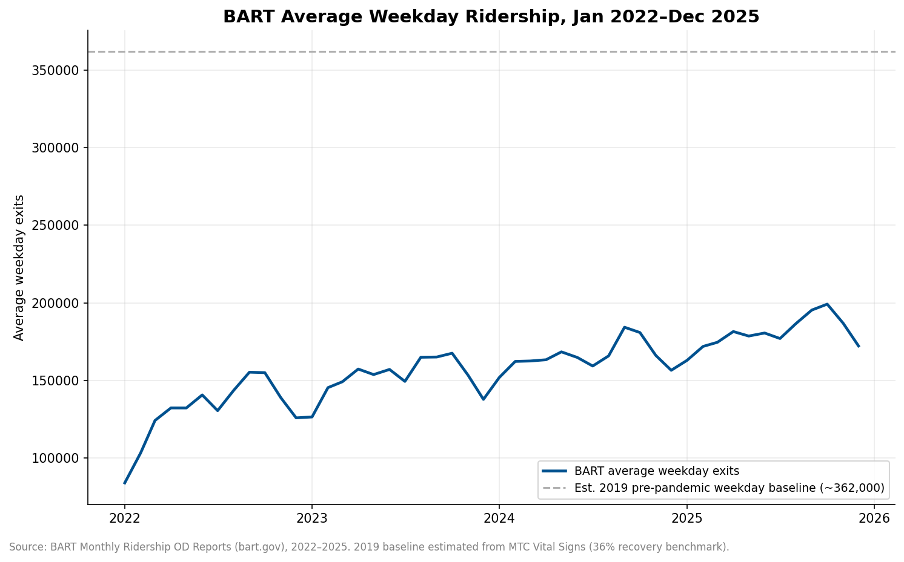
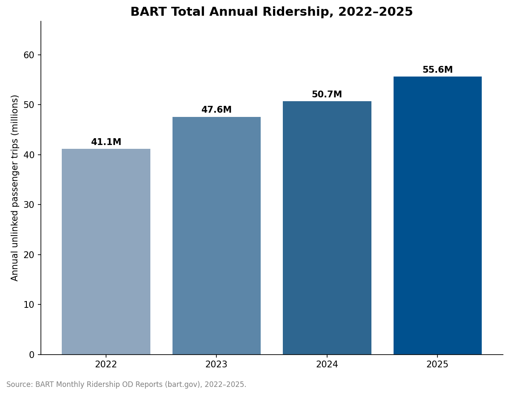

# 🚇 Journ124 Final Project

## The Long Road Back: BART Ridership Is Up 35% Since 2022 — But Still Stuck at Half of Pre-Pandemic Levels

---

### 📑 Table of Contents
- [Project Overview](#project-overview)
- [Data Source](#data-source)
- [Analysis Process](#analysis-process)
- [Data Visualization](#data-visualization)
- [Limitations and Ethical Considerations](#limitations-and-ethical-considerations)
- [Summary](#summary)
- [Files in This Repository](#files-in-this-repository)

---

### Project Overview

This project investigates the post-pandemic recovery of public transit in the San Francisco Bay Area, using BART as a case study. Headlines celebrate BART posting its highest ridership numbers since the pandemic began — and the data confirms real growth: total annual trips rose from **41.1 million in 2022 to 55.6 million in 2025**, a **35% increase**. But that growth has plateaued at roughly half of BART's pre-pandemic (2019) ridership. This analysis asks: is BART actually "recovering," or has hybrid work permanently reset what "normal" ridership looks like — and what does that mean for the system's finances?

> [!IMPORTANT]
> **BART's average weekday ridership grew 38% between 2022 and 2025 — but 2025 levels are still only about half of BART's pre-pandemic (2019) weekday average.**

---

### Data Source

**Primary Data:** Bay Area Rapid Transit (BART) — official Monthly Ridership Origin-Destination (OD) Reports

**Datasets Used:** `Ridership_202201.xlsx` through `Ridership_202512.xlsx` (48 monthly files, Jan 2022–Dec 2025), downloaded from BART's public Ridership Reports page (bart.gov/about/reports/ridership).

**Original Source & Trustworthiness:** These files are published directly by BART and contain station-to-station "entry-exit" matrices (average weekday, Saturday, and Sunday trips, plus total monthly trips) generated from BART's own fare-gate data.

> [!WARNING]
> "Official" doesn't mean automatically neutral:
> - BART is currently facing a projected budget deficit and is actively lobbying for a regional funding measure ("Connect Bay Area"). Agencies in this position have an incentive to publicize "record" ridership months, so any figure BART publicizes in press releases should be checked against the underlying monthly data rather than taken at face value — which is exactly what this project does.
> - The files switched internal formatting partway through 2024 (sheet names and layout changed), which required careful, consistent handling when aggregating.
> - These files measure **unlinked passenger trips** (station exits), not unique riders — someone who transfers or makes a round trip is counted multiple times.

I did not have a matching pre-pandemic (2019) monthly OD file, so the 2019 baseline referenced in this analysis (~362,000 average weekday trips) is estimated by applying BART's own reported 2022 recovery rate (36% of 2019 levels, per MTC's Vital Signs regional dashboard) to my calculated 2022 average. This estimate should be treated as approximate, not exact.

---

### Analysis Process

Each monthly OD file is a station-by-station matrix (50 stations × 50 stations), not a simple row-per-month table — so the first step was extracting a usable systemwide total out of each of the 48 files before any pivot table analysis was possible.

| Step | What I did |
|---|---|
| **1. Extraction** | Pulled the systemwide grand-total figure from each of the four tabs (Average Weekday, Average Saturday, Average Sunday, Total Monthly Trips) — the sum of the entire station-to-station matrix. |
| **2. Restructuring** | Compiled all 48 months into a single long-format time series (one row per month: year, month, avg_weekday, avg_saturday, avg_sunday, total_monthly_trips). |
| **3. Data Cleaning** | BART changed its file format starting with the January 2024 report (different sheet names; "grand total" moved from a labeled "Exits" column to an unlabeled final column in a "Grand Total" row). Verified both formats independently before treating them as equivalent. |
| **4. Pivot Table** | Rows = Year, Values = SUM of `total_monthly_trips` and AVERAGE of `avg_weekday` — produces the annual comparison used below. |
| **5. Calculation** | Year-over-year and multi-year (2022→2025) % change on both metrics. Benchmarked against 2019 using BART's independently reported 2022 recovery rate, rather than fabricating a number. |

Here is a link to my Google Sheets analysis: **(https://docs.google.com/spreadsheets/d/1xn70Cpy2DBHWH4Vqi0FQwYQNd3l4OVrFKdSRsKgyDqA/edit?gid=1549197447#gid=1549197447)]**

📊 Pivot table screenshot (click to expand)

 `

---

### Data Visualization

**Figure 1: BART Average Weekday Ridership, Jan 2022–Dec 2025.**
Average weekday ridership climbed steadily from about 84,000 exits in January 2022 to roughly 172,000–199,000 by late 2025 — but even at its 2025 peak, BART is still running at only about half of its estimated pre-pandemic (2019) weekday average of ~362,000. The dashed line marks that estimated 2019 baseline.

*Source: BART Monthly Ridership OD Reports (bart.gov), 2022–2025; 2019 baseline estimated from MTC Vital Signs.*

**Figure 2: BART Total Annual Ridership, 2022–2025.**
Total annual trips grew every year of the sample, from 41.1 million in 2022 to 55.6 million in 2025 — a 35% increase over three years. This is real, sustained growth, not stagnation. But it has not yet closed the gap with 2019, when BART carried close to 130 million annual trips.

*Source: BART Monthly Ridership OD Reports (bart.gov), 2022–2025.*

*(Line chart used for the time trend; bar chart used for the year-over-year comparison — no pie charts, since this isn't a part-of-a-whole breakdown.)*

---

### Limitations and Ethical Considerations

**Data Limitations:** This dataset measures "unlinked passenger trips," which cannot distinguish between daily commuters, occasional riders, and leisure travelers. A recovery in *total* trips could mask a permanent decline in traditional peak-hour work commuting, offset by growth in weekend/off-peak leisure travel. Additionally, since I lacked an official 2019 monthly file, the pre-pandemic baseline used throughout this project is an estimate, not a directly measured figure.

> [!NOTE]
> **Ethical Reflection:** Transit ridership numbers are not neutral statistics — they directly affect funding decisions. Agencies currently face major budget deficits as pandemic-era federal aid expires, and are proposing service cuts (fewer trains, closed stations, fare hikes) that would disproportionately harm lower-income riders and people without access to a car. Reporting on this topic should avoid two traps: (1) treating "record ridership" headlines as evidence of full recovery, and (2) treating a slow recovery as evidence that transit is "failing," when the underlying driver may be structural changes in office work rather than any flaw in the transit system itself.

**What additional reporting would strengthen this story:** Interviews with transit-dependent riders about how service cuts would affect them; comment from BART planners on how they're redesigning service for off-peak demand; comparison with an agency that has recovered further (e.g., SamTrans, reportedly near 97% of 2019 levels); and pulling BART's actual 2019 data to replace the estimated baseline used here.

---

### Summary

BART's ridership story in 2026 is really two stories at once, and headlines tend to tell only one of them. The first is a genuine recovery: total annual trips grew from 41.1 million in 2022 to 55.6 million in 2025, a 35% increase, and average weekday ridership climbed 38% over the same period, regularly setting new post-pandemic highs by late 2025. That growth is real and worth reporting — it reflects, among other things, more people returning to some in-person work, comfort with public spaces returning post-COVID, and BART's own efforts to improve service and introduce new fare programs.

But the second story is less celebratory: even at its best months in 2025, BART is still running at roughly half of its estimated pre-pandemic (2019) ridership. That is the more important number for understanding BART's financial reality, because BART's funding model was built around a farebox recovery rate near 72% before the pandemic — one of the highest reliance on fares of any major U.S. transit system. A system built to run on close to full pre-pandemic ridership cannot simply "grow its way" back to financial health at the current pace of recovery; even continuing 2022–2025's growth rate for several more years wouldn't fully close the gap.

The reason I chose 2022 as this project's starting point, rather than the headline framing of "compared to last year," is that 2022 itself was a low point — the tail end of the pandemic's disruption to commuting, not a "normal" year. Comparing recent ridership to 2022 alone, as many headlines implicitly do, makes any growth look more impressive than it is relative to what BART actually needs to be financially sustainable. Comparing to 2019 instead gives a more honest picture of the size of the gap that remains.

This gap is not simply a BART problem — it is a broader question about what Bay Area commuting looks like now that hybrid work has become normal for a meaningful share of the workforce that used to ride BART into downtown San Francisco or Oakland every day. If that shift is permanent, the region faces a choice: either transit agencies redesign their service and funding models around a lower, more leisure/off-peak-weighted ridership base, or they continue relying on federal and state bailouts that are, by design, temporary.

There are also real equity stakes here. If BART and other agencies respond to this gap with service cuts — fewer trains, closed stations, higher fares — those cuts will fall hardest on riders who have no alternative: people without cars, lower-income workers, and communities already underserved by other transportation options. A story about "ridership recovery" that doesn't mention this risk is an incomplete story.

Finally, this analysis has real limits. I only had four years of monthly data (2022–2025) and had to estimate rather than directly measure the 2019 baseline, so the "half of pre-pandemic" figure should be read as an informed estimate, not an exact number. A more complete version of this reporting would also break ridership down by individual BART line or station, since a systemwide average can hide very different recovery stories — some stations serving downtown offices may have recovered far less than stations serving residential or entertainment destinations. That distinction matters both for accurate reporting and for understanding who, specifically, would be affected by future service cuts.

---

### Files in This Repository

| File | Description |
|---|---|
| `README.md` | This file |
| `BART_Ridership_2022_2025.csv` | Cleaned monthly time series (2022–2025), extracted from BART's official OD reports |
| `chart1_weekday_trend.png` | Figure 1 — weekday ridership trend |
| `chart2_annual_totals.png` | Figure 2 — annual totals bar chart |
| *(Google Sheets link)* | See [Analysis Process](#analysis-process) section above |

*Data: BART Official Ridership Reports · Analysis: Google Sheets · Charts: Python/matplotlib*

chart1_weekday_trend.png — Figure 1
chart2_annual_totals.png — Figure 2
